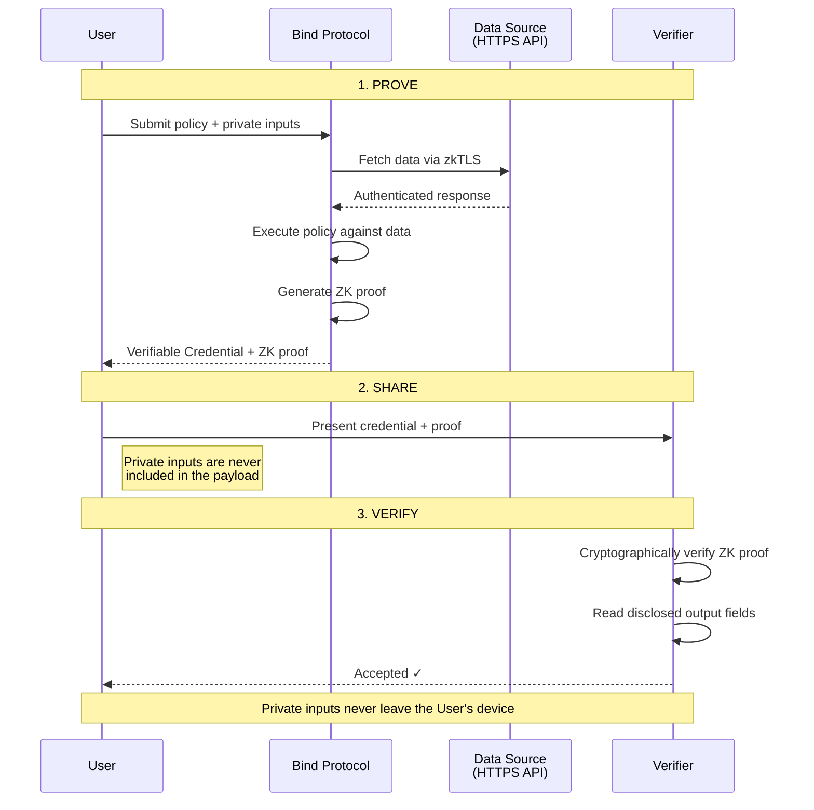

```
              ━━━╸  888888b. 8888888888b    8888888888b.
            ━━━━━╸  888  "88b  888  8888b   888888  "Y88b
          ━━━━━━━╸  888  .88P  888  88888b  888888    888
        ━━━━━━━━━╸  8888888K.  888  888Y88b 888888    888
      ━━━━━━━━━━━╸  888  "Y88b 888  888 Y88b888888    888
    ━━━━━━━━━━━━━╸  888    888 888  888  Y88888888    888
  ━━━━━━━━━━━━━━━╸  888   d88P 888  888   Y8888888  .d88P
━━━━━━━━━━━━━━━━━╸  8888888P"8888888888    Y8888888888P"

                               P R O T O C O L
```

# Bind Protocol SDK Examples

Working examples for [`@bind-protocol/sdk`](https://www.npmjs.com/package/@bind-protocol/sdk).

## Getting Started

### Create a Bind account

- Sign up at [https://dashboard.bindprotocol.xyz](https://dashboard.bindprotocol.xyz)
  - Select `Prover` account type (`Verifer` accounts cannot create proofs, only verify shared proofs and issue W2C JWT credentials)
  - Check your email for the confirmation code
- Navigate to the [Policy Marketplace](`https://dashboard-dev.bindprotocol.xyz/marketplace/policies`)
  - Install one of the `demo` policies, such as `Credit Score Demo`
- Create an [API key](https://dashboard-dev.bindprotocol.xyz/keys)
  - Copy the key
- Run the `setup` script (`npm run setup` or `bash setip.sh`) in the `example` folder for the policy you installed
  - You will be prompted to provide your API key
  - You will also be prompted for a verifer key, you can use the same API key from your `Prover` account
- Run the various example steps
- Once you've generated a proof you will get timeboxes, pre-signed S3 download links for the proof artifacts. You can drag and drop these into
the associated file drops in on the [Verify Proof](https://dashboard-dev.bindprotocol.xyz/verify-proof) page if you wish, or you can navigate to
the [Prove Jobs](https://dashboard-dev.bindprotocol.xyz/prove-jobs) page. 
- If you've run the `verify` step you can see an issued credentail on the [Credentials](https://dashboard-dev.bindprotocol.xyz/proof-credentials) page
## Prerequisites

- Node.js 18+
- A Bind Protocol API key

## Examples

| Example | Description | Key concepts |
|---------|-------------|--------------|
| [credit-score](./credit-score/) | Credit-score verification with ZK proofs | Policies, prove jobs, proof sharing, verification |

## Quick Start

```bash
cd credit-score
npm run setup
```

The setup script walks you through creating a `.env` file and installing dependencies. From there, run `npm start` to execute the full demo flow.

## How It Works

Each example follows the same core flow:



See each example's README for the full walkthrough.

## References

- [`@bind-protocol/sdk` on npm](https://www.npmjs.com/package/@bind-protocol/sdk)
- [`@bind-protocol/policy-spec` on npm](https://www.npmjs.com/package/@bind-protocol/policy-spec)
- [Documentation](https://docs.bindprotocol.xyz)
- [Website](https://bindprotocol.xyz)
